# 🛒 Inventario AVA


Sistema web empresarial para la gestión de inventarios desarrollado con Python, Flask y SQL Server.

Permite administrar productos, controlar stock, registrar ventas, generar reportes, realizar respaldos automáticos y exponer funcionalidades mediante una API REST protegida con JWT.

---

🚀 Tecnologías Utilizadas

- attrs==26.1.0
- blinker==1.9.0
- charset-normalizer==3.4.7
- click==8.3.3
- colorama==0.4.6
- contourpy==1.3.3
- cycler==0.12.1
- et_xmlfile==2.0.0
- flasgger==0.9.7.1
- Flask==3.1.3
- Flask-JWT-Extended==4.7.4
- fonttools==4.63.0
- itsdangerous==2.2.0
- Jinja2==3.1.6
- joblib==1.5.3
- jsonschema==4.26.0
- jsonschema-specifications==2025.9.1
- kiwisolver==1.5.0
- MarkupSafe==3.0.3
- matplotlib==3.10.9
- mistune==3.2.1
- numpy==2.4.6
- openpyxl==3.1.5
- packaging==26.2
- pandas==3.0.3
- pillow==12.2.0
- PyJWT==2.13.0
- pyodbc==5.3.0
- pyparsing==3.3.2
- python-dateutil==2.9.0.post0
- PyYAML==6.0.3
- referencing==0.37.0
- reportlab==4.5.1
- rpds-py==2026.5.1
- scikit-learn==1.8.0
- scipy==1.17.1
- six==1.17.0
- threadpoolctl==3.6.0
- tzdata==2026.2
- Werkzeug==3.1.8


---

## ✨ Funcionalidades

### 📦 Gestión de Inventario
- Crear productos
- Editar productos
- Eliminar productos
- Papelera de reciclaje
- Reactivar productos
- Control de stock

### 💰 Gestión de Ventas
- Registro de ventas
- Descuento automático de inventario
- Validación de stock
- Historial de ventas
- Ganancias totales 
- Registro automático de ventas.
- Historial cronológico de movimientos.
- Asociación entre productos y ventas.
- Consulta de fecha y cantidad vendida.
- Visualización desde la interfaz web.
- visualizacion ganancias totales (día, mes, año)

### 📊 Reportes y Estadísticas
- Dashboard interactivo
- Reportes PDF
- Reportes Excel
- Indicadores empresariales

### 🔐 Seguridad
- Login de usuarios
- JWT
- Roles
- Protección de rutas
- Manejo global de errores

### 💾 Respaldo de Datos
- Backups automáticos SQL Server
- Descarga desde interfaz web   

---

## 🌟 Vista General del Sistema

- Gestión de Inventario
- Dashboard Empresarial
- Reportes PDF y Excel
- API REST con JWT
- Respaldos Automáticos
- Machine Learning para predicción de stock
- Acceso remoto desde dispositivos móviles mediante Ngrok.

---

# 📸 Capturas del sistema

## 🔑 Login

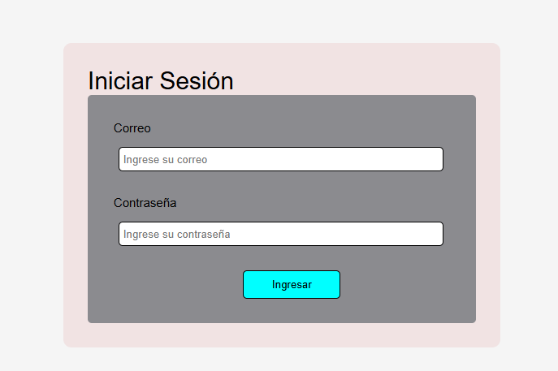

---

## 📦 Dashboard y Estadísticas

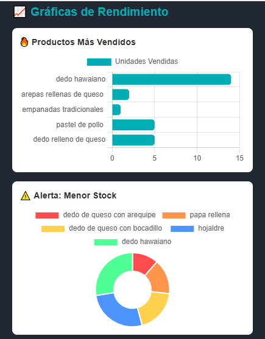


---

## 📦 Dashboard de Ganancias

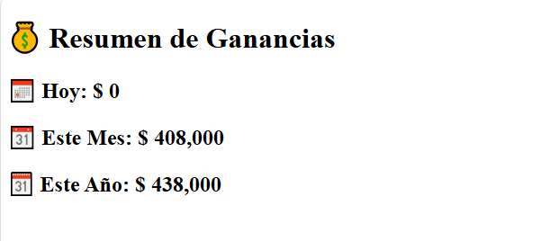


---

## 📦 Menú productos

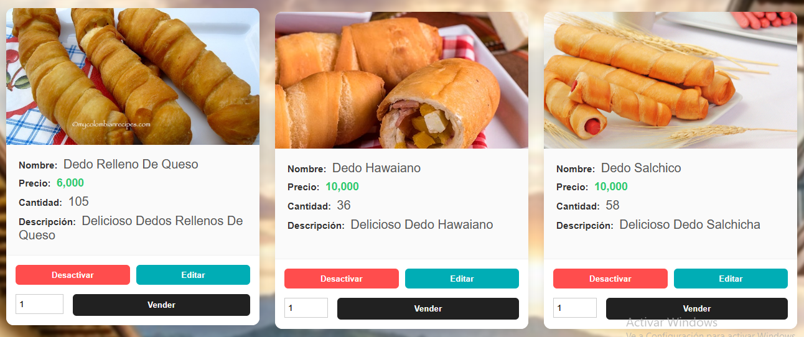

---

## 📦 Reportes

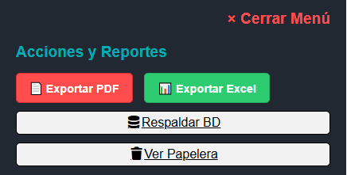

---

## 📦 Base de datos del sistema

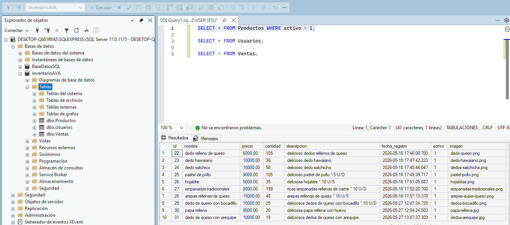

---

## ✔ Pruebas con Postman

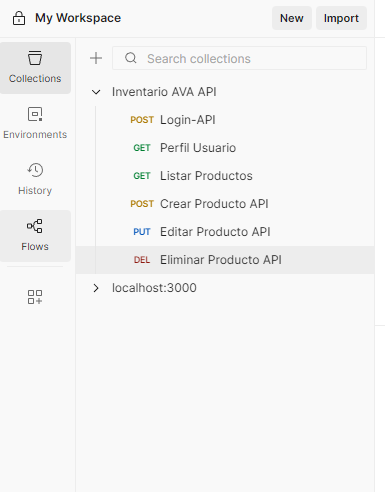

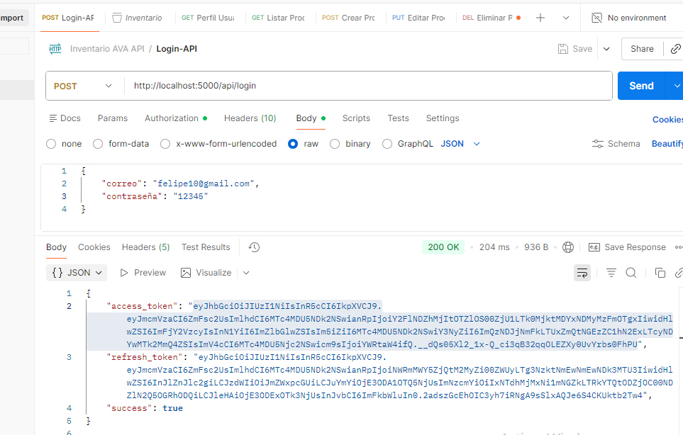

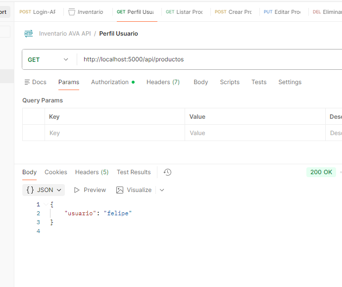

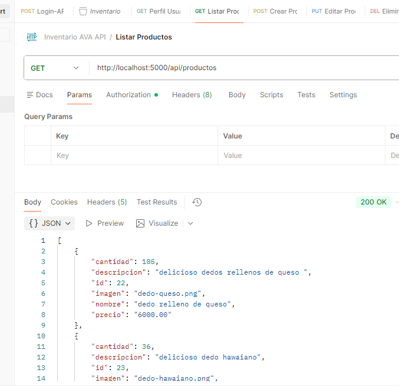

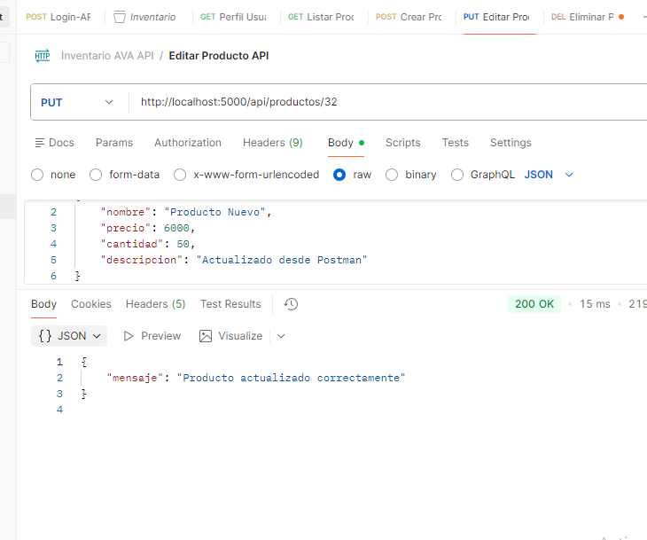

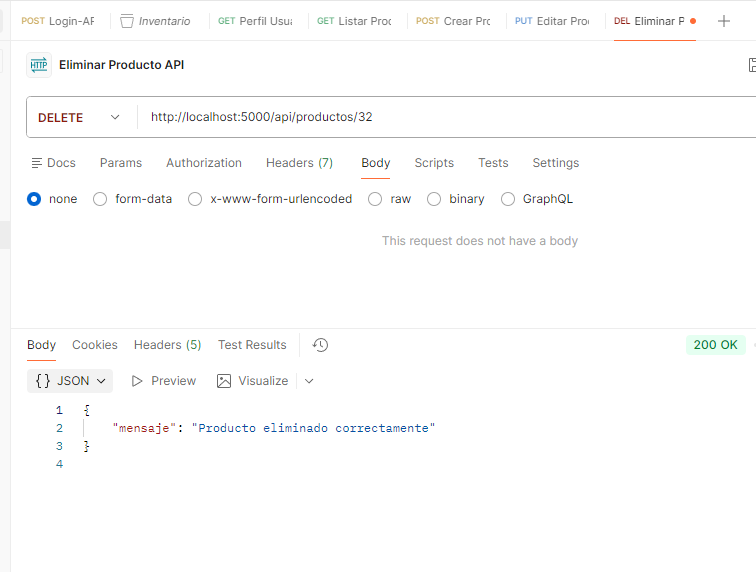

---

## 📦 Pruebas de interfaz responsive. Móvil

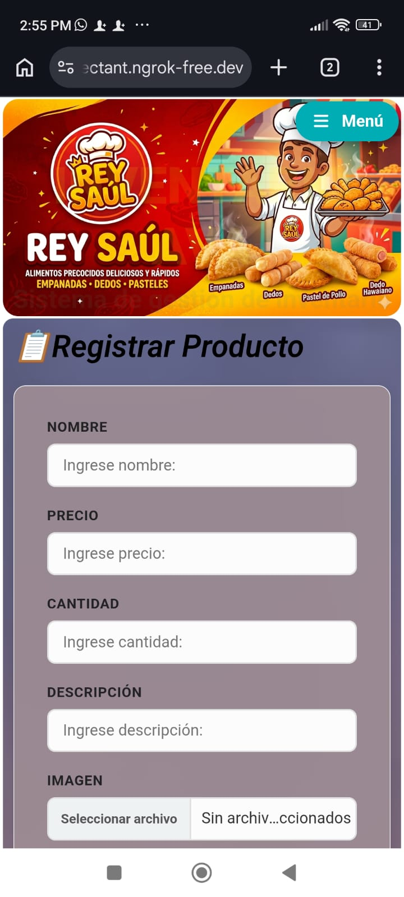

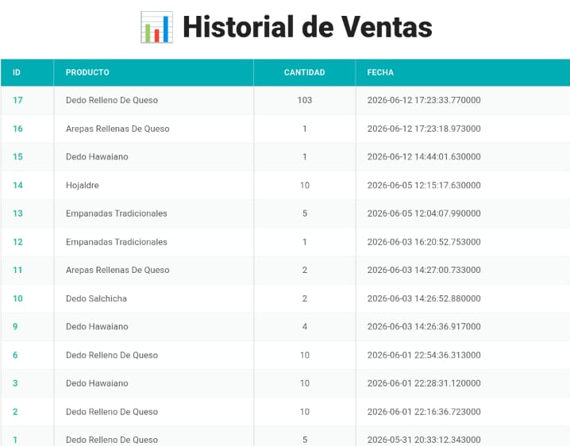


---

## 📋 Requisitos

- Python 3.13+
- flask
- SQL Server Express
- ODBC Driver 17 o superior
- Git

---

## ⚙️ Instalación

### Clonar repositorio

git clone https://github.com/FelipeValencia-Dev90/Inventario-Mafe.git

### Crear entorno virtual

python -m venv venv

### Activar entorno

venv\Scripts\activate

### Instalar dependencias

pip install -r requirements.txt

### Ejecutar aplicación

python app.py

---

## 🤖 Inteligencia Artificial y Machine Learning

El proyecto incorpora un módulo experimental de análisis predictivo desarrollado en Python utilizando Machine Learning.

### Tecnologías utilizadas

- Pandas
- NumPy
- Scikit-Learn
- Matplotlib

### Funcionalidades

- Predicción de stock futuro
- Identificación de productos en riesgo
- Visualización gráfica de resultados
- Soporte para la toma de decisiones

Archivo principal:

ml/prediccion_stock.py

---

## 📚 Documentación API

Swagger UI:

http://localhost:5000/apidocs/

---

## 🔌 API REST

Endpoints principales:

| Método | Endpoint | Descripción |
|---------|-----------|-------------|
| POST | /api/login | Iniciar sesión |
| GET | /api/perfil | Perfil autenticado |
| GET | /api/productos | Listar productos |
| POST | /api/productos | Crear producto |
| PUT | /api/productos/<id> | Editar producto |
| DELETE | /api/productos/<id> | Eliminar producto |

---

📂 Estructura del Proyecto

La arquitectura sigue un patrón modular y limpio utilizando Blueprints de Flask para una organización profesional del backend:

InventarioAVA/
│
├── app.py
├── crear_usuario.py
├── Inventario AVA API.postman_collection.json
├── README.md
├── requirements.txt
│
├── backups/
│   ├── inventario_20260603_084123.bak
│   └── inventario_20260603_162202.bak
│
├── cli/
│
├── database/
│   └── conexion.py
│
├── logs/
│   └── sistema.log
│
├── ml/
│   └── prediccion_stock.py
│
├── routes/
│   ├── __init__.py
│   ├── auth.py
│   └── productos.py
│
├── static/
│   ├── ganancias.css
│   ├── historial.css
│   ├── login.css
│   ├── style.css
│   ├── top-productos.css
│   ├── imagenes/
│   └── screenshots/
│
├── templates/
│   ├── editar_producto.html
│   ├── ganancias.html
│   ├── historial.html
│   ├── index.html
│   ├── login.html
│   └── papelera.html
│
├── tests/
│
├── utils/
│
└── venv/
---

## 📱 acceso desde dispositivos Moviles 

El sistema fue probado exitosamente desde dispositivos móviles mediante Ngrok.

### Configuración

```bash
ngrok config add-authtoken TU_TOKEN

- python app.py
- ngrok http 5000

---

## 🏆 Logros Técnicos

- Arquitectura modular con Flask Blueprints
- API REST protegida con JWT
- SQL Server integrado mediante PyODBC
- Dashboard empresarial
- Reportes PDF y Excel
- Backups automáticos
- Machine Learning aplicado al inventario
- Documentación Swagger
- Testing API con Postman
---

🔗 **Repositorio del Proyecto:** [Inventario-Mafe](https://github.com/FelipeValencia-Dev90/Inventario-Mafe)

---

## 📄 Licencia

Proyecto desarrollado con fines educativos y de fortalecimiento profesional.

---

## 👨‍💻 Autor

Andrés Felipe Valencia Alvis

Tecnólogo en Análisis y Desarrollo de Software

Proyecto desarrollado como práctica profesional y fortalecimiento de habilidades en desarrollo web Full Stack con Python.
