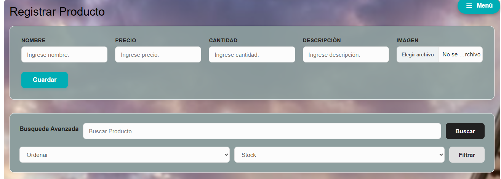
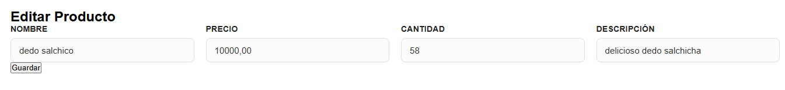

# 🛒 INVENTARIO AVA

Sistema web de gestión de inventario desarrollado con Flask, SQL Server y Python.

Permite administrar productos, controlar stock, gestionar imágenes, autenticación de usuarios y operaciones CRUD completas.

---

✨ Características Principales

🔐 Sistema de Autenticación y Seguridad
Inicio de sesión seguro: Control de sesiones de usuario (session) y manejo de rutas protegidas.

Cifrado avanzado: Hash de contraseñas mediante generate_password_hash() y validación con check_password_hash().

Seguridad API: Implementación de tokens JWT para la protección de endpoints de la API REST.

Roles de usuario: Control de accesos basado en permisos y perfiles del sistema.

Validación estricta: Validación de formularios, prevención de registros inválidos y manejo global de errores.

---

🚀 Tecnologías Utilizadas

Backend: Python & Flask (Arquitectura modular con Blueprints).

Base de Datos: SQL Server (Conectado mediante PyODBC).

Autenticación: Flask Sessions & JWT (JSON Web Tokens).

Frontend: HTML5, CSS3, JavaScript y Bootstrap.

Motor de Plantillas: Jinja2.

Librerías de Datos y Reportes:

OpenPyXL: Manipulación y exportación a archivos Excel.

ReportLab: Diseño y estructuración de reportes PDF.

Matplotlib: Generación de gráficos estadísticos empresariales.

Documentación: Swagger API Documentation.

Machine Learninig: Pandas, NumPy

---

# 📸 Capturas del sistema

## 🔑 Login

---

## 📦 Menú productos

---

## 📦 Reportes

---

## 📦 Registro y Busqueda

---

## 📦 Menú hamburguesa

---

## 📦 Editar producto

---

## 📦 Dashboard y Estadísticas

---

📦 Gestión de Inventario (CRUD Completo)

Operaciones CRUD: Registrar, editar, consultar y eliminar productos con filtros avanzados de búsqueda y ordenamiento por stock.

Ciclo de vida del producto: Sistema de desactivación y papelera de reciclaje con opción para reactivar productos o realizar la eliminación permanente.

Control de existencias: Indicadores visuales automáticos para productos en stock crítico o agotados.

---

🖼️ Gestión de Imágenes

Carga y almacenamiento seguro de archivos en el servidor.

Validación estricta de formatos permitidos y asociación dinámica de imágenes a cada producto.

---

💰 Gestión de Ventas e Historial

Registro de operaciones de venta con descuento automático en el inventario real.

Validaciones lógicas de negocio (control de stock disponible y prevención de ingreso de cantidades negativas).

Historial auditable de transacciones comerciales.

---

📊 Dashboard y Estadísticas Empresariales

Indicadores clave de rendimiento (KPIs) en tiempo real: productos activos, unidades totales disponibles, valor económico total del inventario y volumen de ventas.

Gráficas automáticas para la toma de decisiones: rendimiento de inventario y listado de los productos más vendidos.

---

📄 Reportes Profesionales y Auditoría

Exportación a PDF: Diseñado con formato corporativo, limpio y listo para impresión de inventarios a través de ReportLab.

Exportación a Excel: Reportes en formato de hoja de cálculo mediante OpenPyXL para análisis externos de datos.

Sistema de Logs: Registro histórico de eventos críticos y errores en el archivo logs/sistema.log.

---

💾 Sistema de Respaldos (Backups)

Creación y descarga de copias de seguridad de la base de datos directamente desde la interfaz web.

Generación automática de archivos estructurados .bak para la prevención de pérdida de información.

---

🔌 API REST y Documentación Interactiva

API completamente funcional para interactuar de manera externa con el sistema (Login, perfil, consultas, creación, edición y eliminación).

Documentación interactiva e integrada mediante Swagger UI accesible localmente en: http://localhost:5000/apidocs/

---

🛡️ Seguridad

- Validación de formularios
- Validación de imágenes
- Protección de rutas
- Manejo global de errores
- Validaciones de negocio
- Prevención de registros inválido

---

📂 Estructura del Proyecto

La arquitectura sigue un patrón modular y limpio utilizando Blueprints de Flask para una organización profesional del backend:

InventarioAVA/
│
├── app.py  
├── crear_usuario.py  
├── Inventario AVA API.postman_collection.json
├── README.md  
├── requirements.txt  
│
├── backups/  
│ ├── inventario_20260603_084123.bak
│ └── inventario_20260603_162202.bak
│
├── cli/  
│
├── database/  
│ └── conexion.py  
│
├── logs/  
│ └── sistema.log  
│
├── ml/  
│ ├── prediccion.stock.py
|
├── routes/  
│ ├── **init**.py  
│ ├── auth.py  
│ └── productos.py  
│
├── static/  
│ ├── style.css  
│ ├── imagenes/  
│ └── screenshots/  
│
├── templates/  
│ ├── editar_producto.html
│ ├── index.html
│ ├── login.html
│ └── papelera.html
│
├── tests/  
│
├── utils/  
│
|── venv/

🤖 Inteligencia Artificial y Machine Learning

Se incorporo un módulo experimental de análisis predictivo desarrollado en Python utilizando Machine Learning.

### Tecnologías utilizadas

- Pandas
- NumPy

---

🧠 Aprendizajes Clave Adquiridos

Durante el desarrollo de este proyecto se consolidaron habilidades técnicas avanzadas en:

Implementación de arquitecturas modulares con Flask Blueprints.

Gestión avanzada de sesiones, tokens de seguridad (JWT) y protección de rutas.

Conexión y optimización de consultas relacionales utilizando SQL Server y PyODBC.

Manejo seguro de archivos, procesamiento y validación de subidas de imágenes.

Desarrollo backend estructurado bajo estándares profesionales de organización y manejo global de logs/errores.

---

## 👨‍💻 Autor

Andrés Felipe Valencia Alvis

Tecnólogo en Análisis y Desarrollo de Software

Proyecto desarrollado como práctica profesional y fortalecimiento de habilidades en desarrollo web Full Stack con Python.
